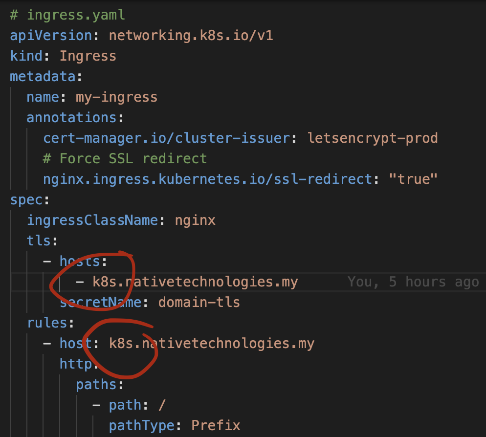
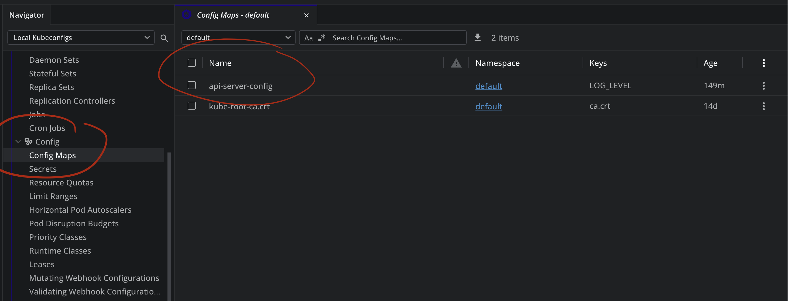

# 2. Using ConfigMap for env

### 1. Update the domain to your domain.



### 2. Apply changes

Run commands on your Terminal/PowerShell.

```bash
kubectl apply -f ./01-env-using-configmaps/

kubectl get cm
```


