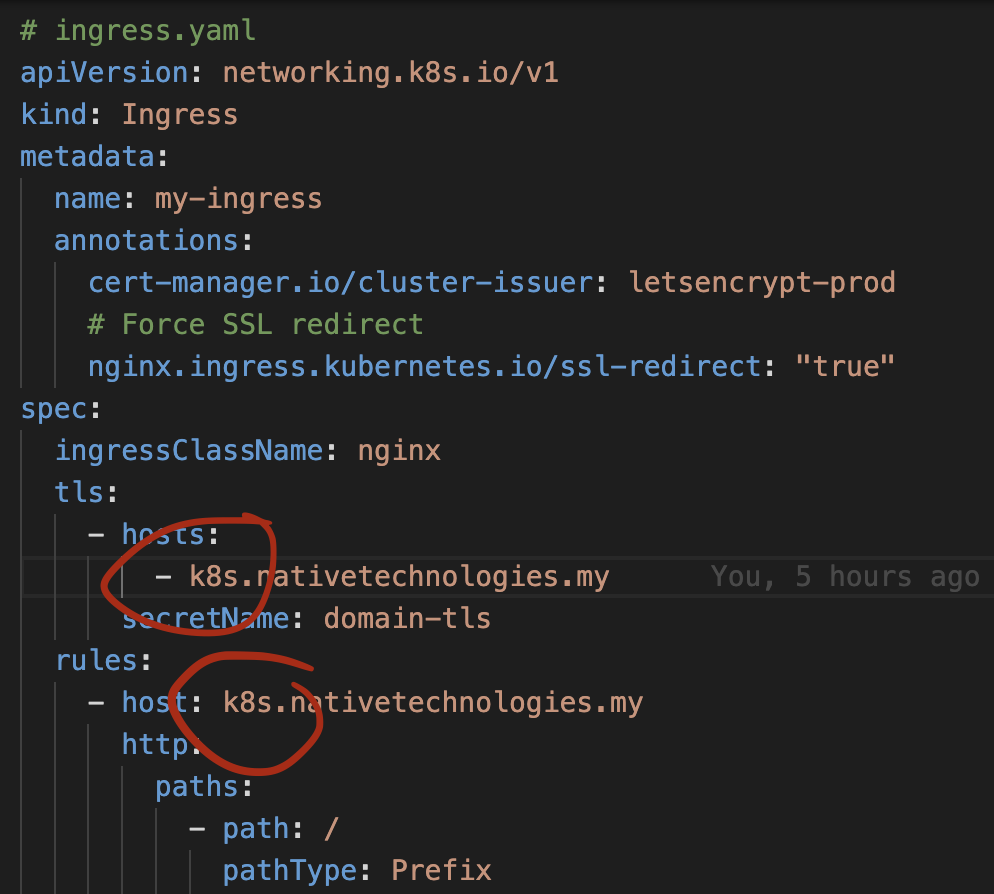
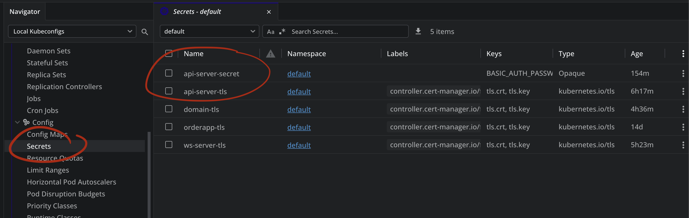

# 2. Using Secret for env

### 1. Update the domain to your domain.



### 2. Apply changes

Run commands on your Terminal/PowerShell.

```bash
kubectl apply -f ./02-env-using-secrets/

kubectl get secrets
```


